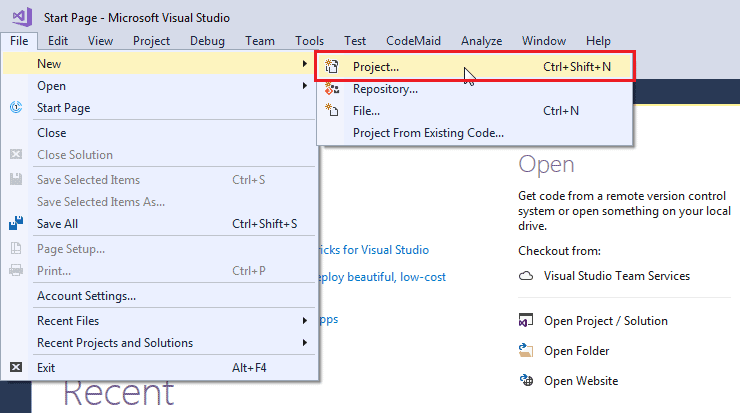
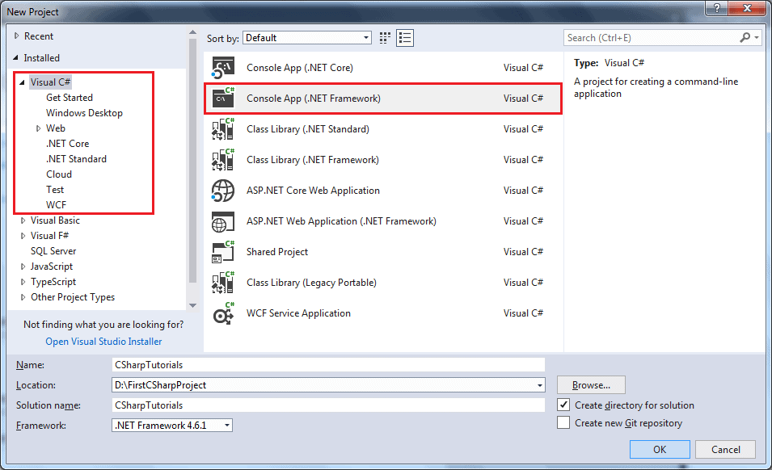
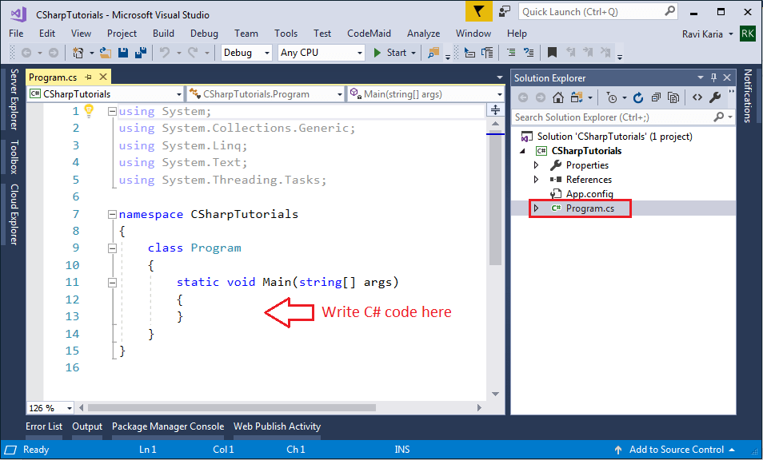

### *Session 1*

C# is a simple, modern, general-purpose, object-oriented **programming** language developed by Microsoft within its .NET initiative led by Anders Hejlsberg, it is pronounced as “**C sharp**”.

C# can be used to create various types of applications, such as web, windows, console applications, or other types of applications using Visual studio.

C# programming is very much based on C and C++ programming languages, so if you have a basic understanding of C or C++ programming, then it will be fun to learn C#.

## What is .NET ?
.NET is a free, open-source development platform for building many kinds of application such as Web applications, Web API's, Microservices, Mobile applications, Desktop applications, Game development, Internet of Things, Machine learning etc.

There is a variety of programming languages available on the .NET platform, VB.NET and C# being the most common ones.
.NET Framework supports more than **60** programming languages in which **11** programming languages are designed and developed by Microsoft. The remaining Non-Microsoft Languages are supported by .NET Framework but not designed and developed by Microsoft.

The **11** Programming Languages which are designed and developed by Microsoft are:
*	C#.NET
*	VB.NET
*	C++.NET
*	J#.NET
*	F#.NET
*	JSCRIPT.NET
*	WINDOWS POWERSHELL
*	IRON RUBY
*	IRON PYTHON
*	C OMEGA
*   ASML(Abstract State Machine Language)

## First C# Application

Here, you will learn to create a simple console application in C# and understand the basic building blocks of a console application.

C# can be used in a window-based, web-based, or console application. To start with, we will create a console application to work with C#.

Visual Studio - The IDE


Visual studio is a developer friendly, feature-rich program that supports many aspects of software development. The Visual Studio IDE is a creative launching pad that you can use to edit, debug, and build code, and then publish an app.

Over and above the standard editor and debugger that most IDEs provide, Visual Studio includes compilers, code completion tools, graphical designers, and many more features to enhance the software development process.

You can download and install a free and latest community version of visual studio here: https://visualstudio.microsoft.com/vs/community/

## Create new project

Open Visual Studio installed on your local machine. Click on File -> New -> Project from the top menu, as shown below.



From the New Project popup, shown below, select Visual C# in the left side panel and select the Console App in the right-side panel.



In the name section, give any appropriate project name, a location where you want to create all the project files, and the name of the project solution.

Click OK to create the console project. Program.cs will be created as default a C# file in Visual Studio where you can write your C# code in Program class, as shown below. (The .cs is a file extension for C# file.)



Every console application starts from the Main() method of the Program class. The following example displays "Hello World!!" on the console.

```c#
using System;
using System.Collections.Generic;
using System.Linq;
using System.Text;
using System.Threading.Tasks;

namespace SkillHouseCSharp
{
    class Program
    {
        static void Main(string[] args)
        {
            string message = "Hello World!!";

            Console.WriteLine(message);
        }
    }
}
```

## Compile and Run C# Program
To see the output of the above C# program, we have to compile it and run it by pressing Ctrl + F5 or clicking the Run button or by clicking the "Debug" menu and clicking "Start Without Debugging".

## .NET Fiddle


If you want to try C# editor online quickly without opening Visual Studio, you can try .NET Fiddle tool which provides an environment to directly write some C# code and execute them on your browser.

https://dotnetfiddle.net/

## :white_check_mark: Tasks
:white_check_mark: Create a new Console application in Visual Studio and language as C# and write a program to print `Hello Skillhouse!`.

:white_check_mark: Create a new Console application in Visual Studio and language as C# and perform following operations:
1.	Read the options such as Add, Subtract, Multiply and Divide from the user
Hint: `Console.ReadLine`
2.	Based on the operation selected ask for following input
3.	If Addition is selected, Enter the first and second number for addition
4.	If Subtraction is selected, Enter the number 1 and number 2 for subtraction
5.	If Multiplication is selected, Enter the number 1 and number 2 for multiplication
6.	If Division is selected, Enter the number 1 and number 2 for Division 
7.	Display the result

:white_check_mark: Create a new Console application in Visual Studio and language as C# and perform following tasks:
1.	Add a new class named `Employee.cs` to the project
2.	Add properties like Name, Age, Salary with respective data types. Hint: Name is of type `string`.
3.	Add properties like AddressStreet1, AddressStreet2 and City with respective data types
4.	Create an instance of the class named `Employee` in the `Main.cs`
5.	Assign values to the object (all the Employee properties)
6.	Display the Employee Name and Salary. Hint: `Console.WriteLine`

✅ Perform below Visual studio interactions:
1. Open Solution Explorer. Pin solution explorer, Unpin solution explorer
2. Open Output Window
3. Open Package Manager Console
4. Debug the application. Put a break point and hit the break point. 
5. Close the visual studio and open the solution again by File->Open Solution window


### *End of session 1*

<br>

### [Session 2](./session2.md)