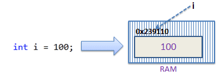
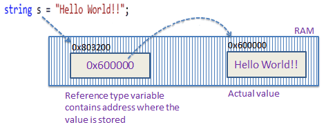

### *Session 3*

## Data types

C# is a **strongly typed** language. It means we must declare the type of a variable that indicates the kind of values it is going to store, such as integer, float, decimal, text, etc.

*[Note to the instructor: Give example of loosely typed language such as JavaScript and give an example]*

The following declares and initializes variables of different data types.

```c#
string stringVar = "Hello World!!";
int intVar = 100;
float floatVar = 10.2f;
char charVar = 'A';
bool boolVar = true;
```

C# mainly categorized data types in two types: **Value types** and **Reference types**.

**Value types**: Include simple types (such as int, float, bool, and char), enum types, struct types, and Nullable value types.

**Reference types**: Include class types, interface types, delegate types, and array types.


## Value Data types:
Value Data Type stores the value directly in the variable, they are simple types where the values can be a piece of information not too complex.

For example, consider integer variable int i = 100;

The system stores 100 in the memory space allocated for the variable i. The following image illustrates how 100 is stored at some hypothetical location in the memory (0x239110) for 'i':



## Reference data types:

Variables of reference types store references to their data (objects). It stores the address where the value is being stored. In other words, a reference type contains a pointer to another memory location that holds the actual data.

For example, consider the following string variable:
string s = "Hello World!!";

The following image shows how the system allocates the memory for the above string variable.




As you can see in the above image, the system selects a random location in memory (0x803200) for the variable s. 

The value of a variable s is 0x600000, which is the memory address of the actual data value. Thus, reference type stores the address of the location where the actual value is stored instead of the value itself.

The followings are the built-in reference types:

### 1. The Object Type

object totalCountObj = 200; // is boxing, converting the numeric value to an object type
object objHasFailed = true; // is also boxing, converting a boolean value to an object type

int totalCount = (int)(totalCountObj); // is unboxing, converting totalCountObj back to the actual type (int)
bool hasFailed = (bool)(objHasFailed); // is also unboxing, converting objHasFailed back to the actual type (bool)

### 2. The String Type

The string type represents a sequence of zero or more Unicode characters. string is an alias for System.String in .NET.

string a = "hello";

string b = "world";

// Append to contents of 'a' and 'b'

string result = a + b; // operator + concatenates the strings.

Console.WriteLine(result);

Verbatim string literals start with @ and are also enclosed in double quotation marks. For example:

@"good morning"  // a string literal

The advantage of verbatim strings is that escape sequences are not processed, which makes it easy to write, for example, a fully qualified Windows file name:

@"c:\Docs\Source\a.txt"  // rather than "c:\\Docs\\Source\\a.txt"


## ✅ Tasks

✅ Create a new Console application in Visual Studio and language as C# and write a program to declare and initialize variables of different data types. Example: Declare variables to represent attributes of an Employee like EmployeeId, FullName, Age, IsMarried, Salary (float / double), Address, PhoneNumber.

✅ What is the output of following code?

Example: Passing Value Type Variables

```c#
static void ChangeValue(int x)
{
    x =  200;

    Console.WriteLine(x);
}

static void Main(string[] args)
{
    int i = 100;

    Console.WriteLine(i);
    
    ChangeValue(i);
    
    Console.WriteLine(i);
}
```

✅ What is the output of following code?

```c#
static void ChangeReferenceType(Student std2)
{
    std2.StudentName = "Steve";
}

static void Main(string[] args)
{
    Student std1 = new Student();
    std1.StudentName = "Bill";
    
    ChangeReferenceType(std1);

    Console.WriteLine(std1.StudentName);
}
```

✅ What is the output of following code?

```c#
static void ChangeReferenceType(string name)
{
    name = "Steve";
}

static void Main(string[] args)
{
    string name = "Bill";
    
    ChangeReferenceType(name);

    Console.WriteLine(name);
}
```


### *End of session 3*

<br>

### [Session 4](./session4.md)